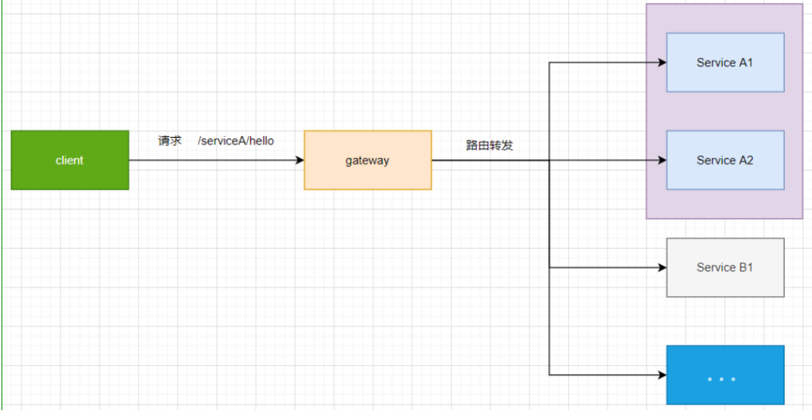

# Spring Cloud、Alibaba 微服务架构实战

## 技术栈

* 注册中心：Nacos、
* 网关：Spring Cloud Gateway
* 消息中间件: Kafka

## ResponseBodyAdvice接口 实现统一响应处理

### 实现作用

实现该接口允许在@ResponseBody或ResponseEntity控制器方法执行**之后**，在使用HttpMessageConverter编写正文**之前**进行**自定义响应**。

### 实现方法

- 注册到RequestMappingHandlerAdapter和ExceptionHandlerExceptionResolver
- @ControllerAdvice进行注释

## Spring Cloud Gateway

### 为什么要使用网关

在微服务架构中，通常一个系统会被拆分为多个微服务，面对这么多微服务客户端应该如何去调用呢？如果没有其他更优方法，我们只能记录每个微服务对应的地址，分别去调用，但是这样会有很多的问题和潜在因素。

1. 客户端多次请求不同的微服务，会增加客户端代码和配置的复杂性，维护成本比价高。
2. 认证复杂，每个微服务可能存在不同的认证方式，客户端去调用，要去适配不同的认证存在跨域的请求，调用链有一定的相对复杂性（防火墙/浏览器不友好的协议）。
3. 难以重构，随着项目的迭代，可能需要重新划分微服务

为了解决上面的问题，微服务引入了 **网关** 的概念，网关为微服务架构的系统提供简单、有效且统一的API路由管理，作为系统的统一入口，提供内部服务的路由中转，给客户端提供统一的服务，可以实现一些和业务没有耦合的公用逻辑，主要功能包含认证、鉴权、路由转发、安全策略、防刷、流量控制、监控日志等。

### 网关在微服务中的作用

* 网关是微服务工程架构下的唯一入口（客户端）
* Gateway提供了统一的路由方式，基于Filter链的方式提供了网关的基本功能



### 网关对比

* **Zuul 1.0** : Netflix开源的网关，使用Java开发，基于Servlet架构构建，便于二次开发。因为基于Servlet内部延迟严重(基于阻塞)，并发场景不友好，一个线程只能处理一次连接请求。
* **Zuul 2.0** : 采用Netty实现异步非阻塞编程模型，一个CPU一个线程，能够处理所有的请求和响应，请求响应的生命周期通过事件和回调进行处理，减少线程数量，开销较小
* **Nginx+lua** : 性能要比上面的强很多，使用Nginx的反向代码和负载均衡实现对API服务器的负载均衡以及高可用，lua作为一款脚本语言，可以编写一些简单的逻辑，但是无法嵌入到微服务架构中
* **Kong** : 基于OpenResty（Nginx + Lua模块）编写的高可用、易扩展的，性能高效且稳定，支持多个可用插件（限流、鉴权）等，开箱即可用，只支持HTTP协议，且二次开发扩展难，缺乏更易用的管理和配置方式
* **GateWay** : 是Spring Cloud的一个全新的API网关项目，替换Zuul开发的网关服务，基于Spring5.0 + SpringBoot2.0 + WebFlux（基于性能的Reactor模式响应式通信框架Netty，异步阻塞模型）等技术开发（支持WebSocket），性能高于Zuul

### Gateway三大核心概念

* Route（路由）：是构建网关的基本模块，由ID、URL、一系列的断言和过滤器组成
* Predicate（断言）：可以匹配HTTP请求中所有的内容（请求头、参数等等），请求与断言相匹配则通过当前断言
* Filter（过滤器）：包含全局和局部过滤器，可以在请求 被路由处理前后 对请求进行更改

  

### Gateway过滤器

* 全局过滤器：作用域所有的路由，不需要单独配置，通常用来实现统一化的处理的业务需求
* 局部过滤器：
  1. 需要实现GatewayFilter、Ordered
  2. 加入到过滤器工厂，并将工厂注册到Spring容器中
  3. 在配置文件中进行配置，如果不配置则不起用此过滤器规则（路由规则）

### Gatway常用的三种配置方式

* 在代码中注入RouteLocatorBean，并手工编写配置路由定义
* 在application.yml、boostrap.yml等配置文件中配置spring.cloud.gateway
* 通过配置中心（Nacos实现动态路由配置）

## Kafka的安装与运行

### 下载地址

下载地址，对于各种操作系统来说，Kafka 的下载地址就只有一个 https://kafka.apache.org/quickstar

### Kafka的相关命令

```shell
# Kafka 依赖于 ZK，先启动 ZK
bin/zookeeper-server-start.sh -daemon config/zookeeper.properties

# 启动 Kafka 服务器
bin/kafka-server-start.sh config/server.properties

# 创建 Topic
create topic: bin/kafka-topics.sh --create --zookeeper localhost:2181 --replication-factor 1 --partitions 1 --topic test

# 查看 Topic 列表
topic list: bin/kafka-topics.sh --list --zookeeper localhost:2181

# 启动 Producer
producer: bin/kafka-console-producer.sh --broker-list localhost:9092 --topic test

# 启动 Consumer
consumer: bin/kafka-console-consumer.sh --bootstrap-server localhost:9092 --topic test --from-beginning

# 查看单个 Topic 信息
topic info: bin/kafka-topics.sh --describe --zookeeper localhost:2181 --topic test

```

> 说明：以上命令适用于 Linux和 Mac OS，对于 Windows 系统来说，需要将 .sh换成 .bat，且命令的目录位于 bin/windows 下面。

## Zipkin 安装与配置

### 下载地址

下载: https://zipkin.io/pages/quickstart.html

### Zipkin的相关操作

```shell
# 简单的看看, 默认端口号是 9411
java -jar zipkin-server-2.19.3-exec.jar
nohup java -jar zipkin-server-2.19.3-exec.jar &

# 访问地址
http://127.0.0.1:9411/

# 修改端口, 因为这就是一个 SpringBoot 应用
java -jar zipkin-server-2.19.3-exec.jar --server.port=8888

# 跟踪数据保存到 MySQL 中（这个是吧sql下载下来，病区创建数据库导入）
wget https://github.com/openzipkin/zipkin/blob/master/zipkin-storage/mysql-v1/src/main/resources/mysql.sql
#启动命令
java -jar zipkin.jar --STORAGE_TYPE=mysql --MYSQL_HOST=127.0.0.1 --MYSQL_TCP_PORT=3306 --MYSQL_USER=zipkin --MYSQL_PASS=zipkin --MYSQL_DB=zipkin

# zipkin 服务端可以从消息中间件 (RabbitMQ, Kafka) 获取跟踪数据, 只需要指定好地址就可以, 默认是 HTTP 接口, 性能较差
# 默认情况下，Zipkin Server 都会将跟踪信息存储在内存中，每次重启 Zipkin Server 都会使得之前收集的跟踪信息丢失，而且当有大量跟踪信息时我们的内存存储也会成为瓶颈
# 所有正常情况下我们都需要将跟踪信息对接到外部存储组件（比如 MySQL、Elasticsearch）中去
java -DKAFKA_BOOTSTRAP_SERVERS=127.0.0.1:9092 -jar zipkin.jar --STORAGE_TYPE=mysql --MYSQL_HOST=127.0.0.1 --MYSQL_USER=zipkin --MYSQL_PASS=zipkin --MYSQL_DB=zipkin
```

## 踩坑

### SpringBoot项目连接Kafka找不到主机，并且还自动把请求的域名或者ip转成了部署kafka主机的主机名

#### 问题日志

```bash
[AdminClient clientId=adminclient-1] Error connecting to node lincheng77:9092
```

#### 我的配置

```yaml
  kafka:
    bootstrap-servers: xxx.xxx.xxx:9092
    producer:
      retries: 3
    consumer:
      auto-offset-reset: latest
  zipkin:
    sender:
      type: kafka # 默认是 web
    base-url: ${security.spring.zipkin.base-url}
  main:
    allow-bean-definition-overriding: true  # 因为将来会引入很多依赖, 难免有重名的 bean
```

#### 解决方案

配置下面三个参数

```properties
# The id of the broker. This must be set to a unique integer for each broker.
#broker是全局唯一编号，不能重复
broker.id=0

############################# Socket Server Settings #############################

# The address the socket server listens on. If not configured, the host name will be equal to the value of
# java.net.InetAddress.getCanonicalHostName(), with PLAINTEXT listener name, and port 9092.
#   FORMAT:
#     listeners = listener_name://host_name:port
#   EXAMPLE:
#     listeners = PLAINTEXT://your.host.name:9092
#监听的端口
listeners=PLAINTEXT://:9092
# Listener name, hostname and port the broker will advertise to clients.
# If not set, it uses the value for "listeners".
#客户端连接的ip地址，必须要写成服务器的ip地址！
advertised.listeners=PLAINTEXT://nas.edkso.cn:9092
```

#### 思考总结

我对于kafka不太了解，kafka需要用到ZooKeeper，就说明kafka是可以部署集群的，并通过ZooKeeper选举，我只部署了一台，当我连上kafka之后，因为我不是在本地机器，又由于我没有去配置相关参数，kafka会默认告诉我找所部属的那台机器（给出的访问地址就是机器名），那我我在远程直接通过机器名肯定连不上！
